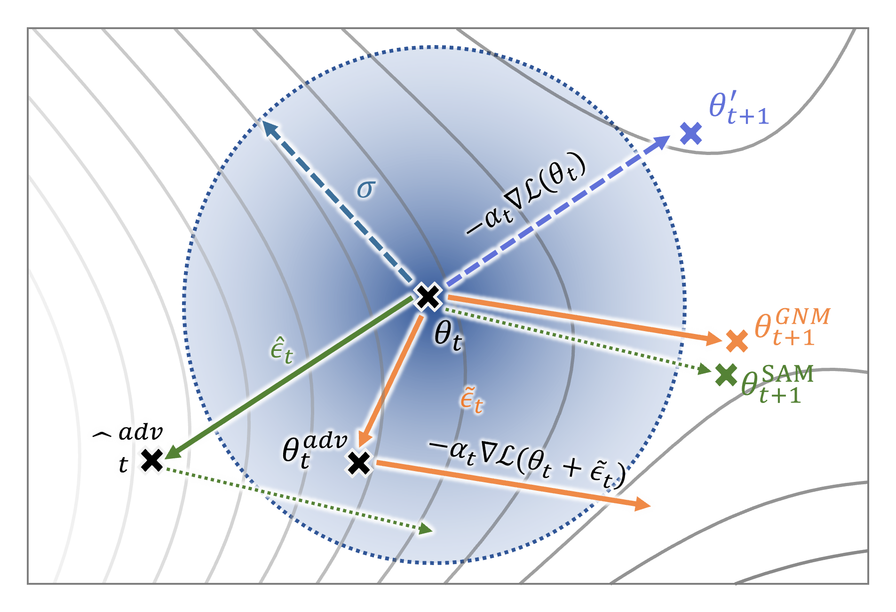

# GNM-PT
Temporary demo for GNM-PT.

The GNM is in [gnm.py](https://github.com/Keke921/RSAM-PT/blob/main/gnm.py). 

This repository is based on unofficial repository [vpt_reproduce](https://github.com/DongSky/vpt_reproduce) by DongSky and unofficial repository [SAM](https://github.com/davda54/sam) by davda54.

Schematic of the parameter update in GNM and SAM. $\boldsymbol{\theta}'_{t+1}$, $\boldsymbol{\theta}^{SAM}_{t+1}$ and $\boldsymbol{\theta}^{GNM}_{t+1}$ represent the gradient update with original SGD, with GNM and with GNM for step $t+1$, respectively.
